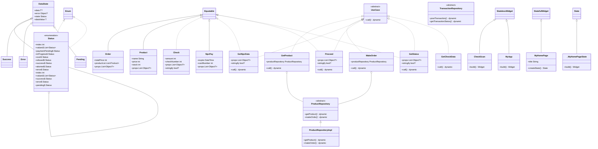

```mermaid
classDiagram
class UseCase
<<abstract>> UseCase
UseCase : +call()* dynamic

class Status
<<enumeration>> Status
Status : +index int
Status : +values$ List~Status~
Status : +paymentPending$ Status
Status o-- Status
Status : +inProgress$ Status
Status o-- Status
Status : +over$ Status
Status o-- Status
Status : +refused$ Status
Status o-- Status
Status : +success$ Status
Status o-- Status
Status : +aborted$ Status
Status o-- Status
Status : +error$ Status
Status o-- Status
Enum <|.. Status

class DataState
DataState : +data T?
DataState : +error Object?
DataState : +state Status
DataState o-- Status
DataState : +dataValue T

class Success
DataState <|-- Success

class Error
DataState <|-- Error

class Pending
DataState <|-- Pending

class Status
<<enumeration>> Status
Status : +index int
Status : +values$ List~Status~
Status : +success$ Status
Status o-- Status
Status : +error$ Status
Status o-- Status
Status : +pending$ Status
Status o-- Status
Enum <|.. Status

class ProductRepositoryImpl
ProductRepositoryImpl : +getProduct() dynamic
ProductRepositoryImpl : +makeOrder() dynamic
ProductRepository <|.. ProductRepositoryImpl

class Order
Order : +totalPrice int
Order : +productList List~Product~
Order : +props List~Object?~
Equatable <|-- Order

class Product
Product : +name String
Product : +price int
Product : +stock int
Product : +props List~Object?~
Equatable <|-- Product

class ProductRepository
<<abstract>> ProductRepository
ProductRepository : +getProduct()* dynamic
ProductRepository : +makeOrder()* dynamic

class GetProduct
GetProduct : +productRepository ProductRepository
GetProduct o-- ProductRepository
GetProduct : +call() dynamic
UseCase <|.. GetProduct

class MakeOrder
MakeOrder : +productRepository ProductRepository
MakeOrder o-- ProductRepository
MakeOrder : +call() dynamic
UseCase <|.. MakeOrder

class Check
Check : +amount int
Check : +checkNumber int
Check : +props List~Object?~
Check : +stringify bool?
Equatable <|.. Check

class NpcPay
NpcPay : +expire DateTime
NpcPay : +cardNumber int
NpcPay : +props List~Object?~
Equatable <|-- NpcPay

class TransactionRepository
<<abstract>> TransactionRepository
TransactionRepository : +postTransaction()* dynamic
TransactionRepository : +getTransactionStatus()* dynamic

class GetNpcData
GetNpcData : +props List~Object?~
GetNpcData : +stringify bool?
GetNpcData : +call() dynamic
Equatable <|.. GetNpcData
UseCase <|.. GetNpcData

class Proceed
Proceed : +props List~Object?~
Proceed : +stringify bool?
Proceed : +call() dynamic
Equatable <|.. Proceed
UseCase <|.. Proceed

class GetStatus
GetStatus : +props List~Object?~
GetStatus : +stringify bool?
GetStatus : +call() dynamic
Equatable <|.. GetStatus
UseCase <|.. GetStatus

class GetCheckData
GetCheckData : +call() dynamic
UseCase <|.. GetCheckData

class CheckScan
CheckScan : +build() Widget
StatelessWidget <|-- CheckScan

class MyApp
MyApp : +build() Widget
StatelessWidget <|-- MyApp

class MyHomePage
MyHomePage : +title String
MyHomePage : +createState() State<MyHomePage>
StatefulWidget <|-- MyHomePage

class _MyHomePageState
_MyHomePageState : +build() Widget
State <|-- _MyHomePageState
```
