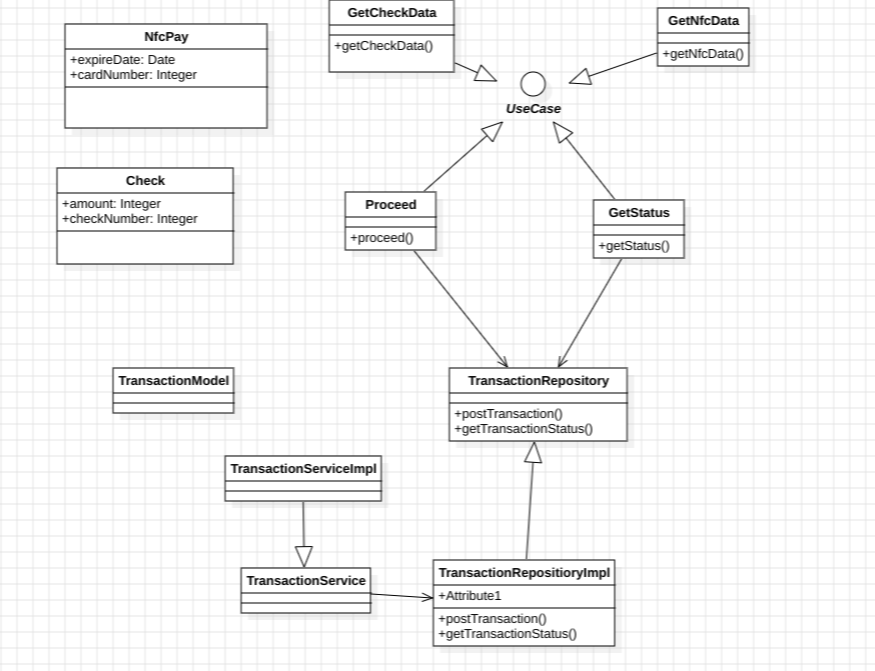

nfc and Qr code just carry data. What data are needed for transaction ?
That data contain ;

- Reference to the Account that want to make a transaction to the shop
- The amount of the transaction / the maximum amount allowed for the transaction
- The payemeent method
- The status
- The date
- All the data needed for the transaction only

Sensitive data will be crypted. This way

- stealing an nfc card does not mean stealing banc account data
- Make sure every catd has the same structure
- Only the server can understand qr code data

To reach this goal we will have a Transaction object repesenting all this.

